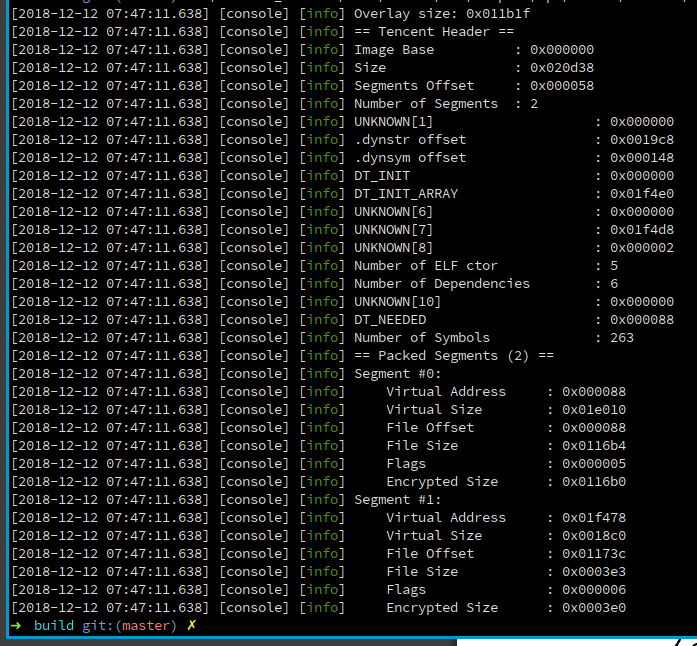
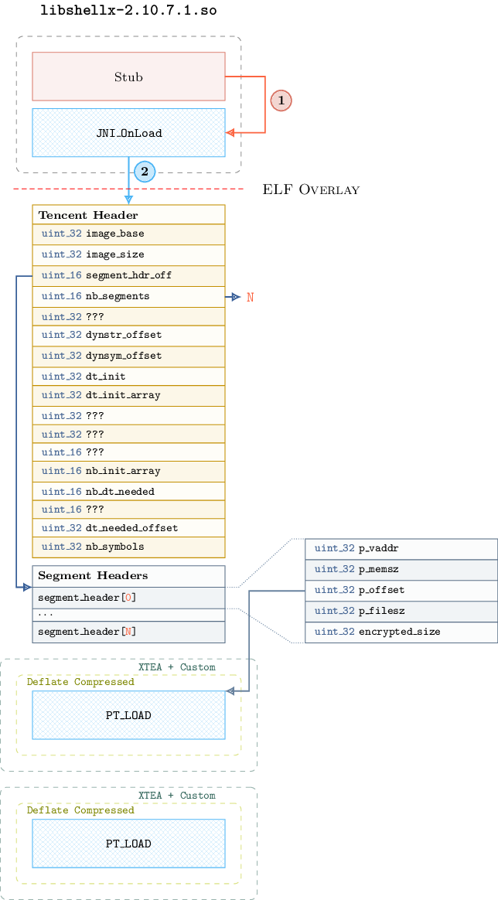
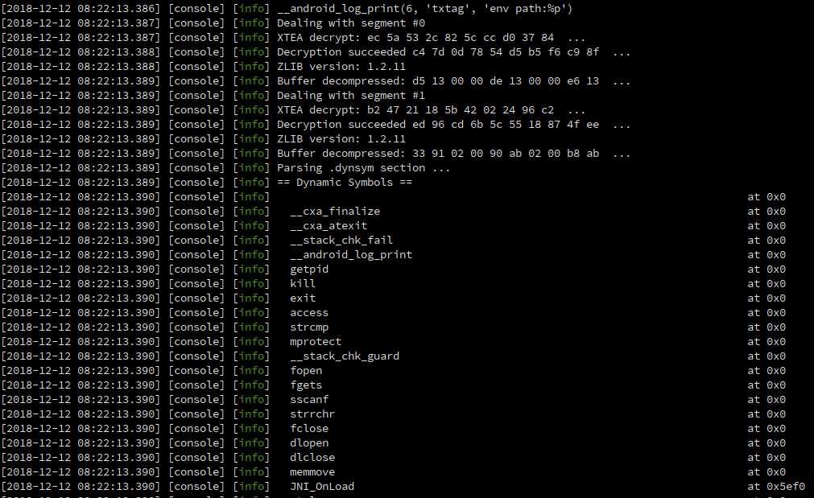

Tencent Packer Reader
=====================

This small utility can be used to read custom structures of ``libshell`` native library.

**IT DOES'T CONTAINS LOGIC TO UNPACK ORIGINAL DEX FILE**

Usage
-----

.. code-block:: console

  ./tencent_reader <libshell{x,a}.so>

Compilation
-----------

.. code-block:: console

   mkdir build && cd build
   cmake .. && make -j4

About Tencent Packer
--------------------

The main logic of the packer is implemented in native a native library named ``libshellx-<version>`` or ``libshella-<version>``. This library has the following layout:

In a first step, the library unpack itself with the following algorithm:

.. code-block:: python

  from numpy import uint8, int8, uint32, int32

  def decrypt(buff):
      v11 = int8(0x2B)
      v10 = int8(0x99)
      v9  = int8(0x20)
      v8  = int8(0x15)
      buff = [uint8(x) for x in buff]
      for i in range(len(buff)):
          v3 = buff[i]
          buff[i] ^= int8(v11 ^ (((v10 - v9) ^ int32(i)) + v8))
          buff[i] += int8(v10 ^ v9 & v8)
          v11 += v3 & (v9 + v10 - v8) & int32(i)
          v10 += v3 ^ (int32(i) + v11)
          v9 ^= (v3 - v11) ^ int32(i)
          v8 += int32(i) - (v3 + v11)
      buff = [x & 0xFF for x in buff]
      return buff

Then it decrypts and decompress segments located in the ELF overlay data. Decryption is done using XTEA on **16 rounds** with the static key ``"Tx:12345Tx:12345`` and blocks are pre-processed with de following function:

.. code-block:: python

  def decrypt_block(block, key, nb_blocks):
     block[0] ^= key[(nb_blocks % 2) * 8]
     block[4] ^= key[(nb_blocks % 2) * 8 + 4]

Finally segments are uncompressed with deflate algorithm:

.. code-block:: cpp

  int err = inflateInit2(&stream, /* Windows Bits*/ -15);
  if (err != Z_OK) {
    console->error("Error while inflateInit2()");
    return {};
  }

  inflate(&stream, Z_NO_FLUSH);
  inflateEnd(&stream);

The newly decrypted and decompressed segments contain the real logic of the packer to decrypt and load the original DEX file.

Especially, the original ``JNI_OnLoad`` is replaced with a new one located in the first segment decrypted:

